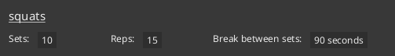
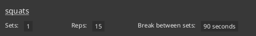
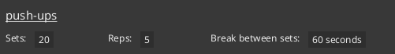
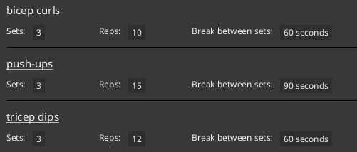

## About FitBook
FitBook is a **desktop app for managing your clients, optimized for use via a Command Line Interface** (CLI) while still having the benefits of a Graphical User Interface (GUI). If you are a personal trainer that prefers typing over mouse interactions, FitBook is the perfect application for you!

### Key features
{:.no_toc}

With FitBook, you can:

* **Seamlessly save clients as contacts on your phone using QR codes**
* **Store personalized notes for each client**
* **Keep track and visualize your clients' weights**
* **Curate personalised workout plans for each client**

_All in one app!_

For more details on what FitBook has to offer, check out the [Features](#features) section below!

## Using this guide
The purpose of this user guide is to **walk you through installing FitBook**, as well as be a **resource you can refer to** if you require any additional help. Think of it like an instruction manual that comes with a new gadget - You can refer to it if you get stuck, but otherwise, you're free to explore on your own!

You can use the [Table of contents](#table-of-contents) to navigate directly to what you're looking for.

:bulb: **Tips/Info**

Be on the lookout for boxes like these, they usually contain important information and helpful tips!

:warning: **Warning**

On the other hand, these boxes indicate when you should pay extra attention to avoid running into problems.

:rotating_light: **Caution**

Lastly, these boxes contain warnings about potential negative outcomes.

(e.g. irreversible loss of data)

Can't wait to get started? [Click me](#setting-up-fitbook) to jump straight to the FitBook installation guide!

_Disclaimer: Certain portions of this guide assume you are familiar with the command line. If you aren't, check out this informative <a href="https://www.freecodecamp.org/news/command-line-for-beginners/" target="_blank">article from freeCodeCamp</a>._

## Table of contents

* Table of Contents
{:toc}

## Setting up FitBook

1. Ensure you have Java **11** or above installed.
    * [What version of Java do I have?](#what-version-of-java-do-i-have)
    * Need help installing Java? Check out the <a href="https://docs.oracle.com/en/java/javase/11/install/overview-jdk-installation.html" target="_blank">Java 11 installation guide</a>.

:question: **What is Java? Is it safe to install?**

Java is a versatile programming language used for developing various applications. FitBook requires it to be installed because it is written in Java and relies on the Java Virtual Machine (JVM) to run.

<a href="https://www.java.com/en/download/help/whatis_java.html" target="_blank">Learn more about Java</a>.

[//]: # (Continue numbering from 2, as the block above interrupts the list and resets the number)

{:start="2"}
1. Download the latest version of `FitBook.jar` from <a href="https://github.com/AY2324S2-CS2103T-T17-3/tp/releases" target="_blank">here</a>.

1. Copy the file to the folder you want to use as the **home folder** for FitBook.
   * FitBook will save all the data it needs in this folder.

1. Double-click the `FitBook.jar` file to launch it.
    * If that doesn't work, try the steps found [here](#why-doesnt-fitbook-start-when-i-double-click).

1. A GUI similar to the one depicted below should appear in a few seconds. The app contains some sample data for you to familiarize yourself with the UI.

    <figure style="text-align: center;">
        
        <figcaption><i>FitBook Graphical User Interface</i></figcaption>
    </figure>

1. Read through `help`, type any command listed into the input box and press `enter`  
   These are some example commands you can try!

   * `add n/John p/98765432` : Adds a client named
   `John Doe` with the number `98765432` to FitBook.

   * `clear` : Clears all clients from the list.

   * `delete 3` : Deletes the third client shown in the list.

   * `exit` : Exits the app.

   * `list` : Lists all clients.

1. Refer to the [Features](#features) below for details of each command.

## Features

**:information_source: Notes about the command format:** 

* Words in `UPPER_CASE` are the parameters to be supplied by the user. 
  e.g. in `add n/NAME`, `NAME` is a parameter which can be used as `add n/John Doe`.

* Items in square brackets are optional. 
  e.g. `n/NAME [t/TAG]` can be used as `n/John Doe t/friend` or as `n/John Doe`.

* Items with `…`​ after them can be used multiple times including zero times. 
  e.g. `[t/TAG]…​` can be used as ` ` (i.e. 0 times), `t/friend`, `t/friend t/family` etc.

* Parameters can be in any order (unless otherwise specified). 
  e.g. if the command specifies `n/NAME p/PHONE_NUMBER`, `p/PHONE_NUMBER n/NAME` is also acceptable.

* Extraneous parameters for commands that do not take in parameters (such as `help`, `list`, `exit` and `clear`) will be ignored. 
  e.g. if the command specifies `help 123`, it will be interpreted as `help`.

* If you are using a PDF version of this document, be careful when copying and pasting commands that span multiple lines as space characters surrounding line-breaks may be omitted when copied over to the application.

### Viewing help : `help`

Launches the help menu depicted below.  
Clicking `Open User Guide` will open the User Guide website on your default browser.

<figure style="text-align: center;">
    
    <figcaption><i>Help Window</i></figcaption>
</figure>

Format: `help`

> Due to a limitation on Linux machines, the `Open User Guide` functionality is not working. Therefore, linux users will be greeted with a `Copy URL` button instead.
>
> 

### Adding a client : `add`

Adds a client to the FitBook.

Format: `add n/NAME p/PHONE_NUMBER [e/EMAIL] [a/ADDRESS] [w/WEIGHT] [h/HEIGHT] [nt/NOTE] [t/TAG]…​` 

* Refer to the [valid parameter table](#parameter-constraints) for more details about input restrictions.
* When HEIGHT and/or WEIGHT is specified to be 0, no height/weight will be added to the client.
* HEIGHT and WEIGHT only take in one value each. For example, the following commands are invalid
  * `add n/Tom p/123 w/85 65`
  * `add n/Tom p/123 h/180 175`

:bulb: **Tip:**
A client can have 0 or more tags.

:warning: **Note:**
FitBook does not allow addition of [duplicate clients](#duplicate-clients).

Examples:
* `add n/John Doe p/98765432 e/johnd@gmail.com a/John street, block 123, #01-01 nt/john from school`
* `add n/Betsy Crowe t/friend e/betsycrowe@hotmail.com a/Newgate Prison p/1234567 nt/likes donuts t/criminal`

### Listing all clients : `list`

Displays an indexed list of all clients in FitBook.

Format: `list`

### Editing a client : `edit`

Edits information tagged to an existing client.

Format: `edit INDEX [n/NAME] [p/PHONE] [e/EMAIL] [a/ADDRESS] [w/WEIGHT] [h/HEIGHT] [nt/NOTE] [t/TAG]…​`

* Edits the clients at the specified `INDEX`. The index refers to the index number shown in the displayed client list.
* At least one of the optional fields must be provided.
* Existing values will be updated to the input values.
* Refer to the [valid parameter table](#parameter-constraints) for more details about input restrictions.
* When no value is specified after a prefix, the value of that prefix will be removed from the client. (e.g. `edit 1 nt/` removes the note from the client at index 1).
    * Since WEIGHT can store multiple historical values, specifying an empty weight prefix removes the latest weight value from the client. Otherwise, the latest weight value will be replaced by the specified weight in this command.
* HEIGHT and WEIGHT only take in one value each. For example, the following commands are invalid
  * `add n/Tom p/123 w/85 65`
  * `add n/Tom p/123 h/180 175`
* When WEIGHT is specified to be 0, the **latest** weight (if any) will be removed from the client.
* Similarly, when HEIGHT is specified to be 0, the height value will be removed from the client.
* When editing tags, all existing tags of the client will be removed before new specified tags are added.
* You can remove all the client’s tags by typing `t/` without
    specifying any tags after it.

:warning: **Note:**
FitBook does not allow any edits that might result in [duplicate clients](#duplicate-clients).

Examples:
*  `edit 1 p/91234567 e/johndoe@example.com` - Edits the phone number and email address of the 1st client to be `91234567` and `johndoe@example.com` respectively.
*  `edit 2 n/Betsy Crower t/` - Edits the name of the 2nd client to be `Betsy Crower` and clears all existing tags.

### Adding a note to a client : `note`

Format: `note INDEX [NOTE] `

* Edits the note of the client specified by `INDEX`. The index refers to the index number shown in the displayed client list.
* Refer to the [valid parameter table](#parameter-constraints) for more details about input restrictions.
* Existing note will be updated to the note specified.
* If no note is given, the note for the client at the specified index will be deleted.

> While this can also be done using the `edit` command, this `note` command serves as a faster way for users to directly modify a note.

Examples:

* `note 1 History of asthma` - Changes the note of the 1st client to `History of asthma`.
* `note 2 Previously sprained both ankles` - Changes the note of the 2nd client to `Previously sprained both ankles`.

If `/edit` is supplied instead of a note, (e.g. `note 1 /edit`), `/edit` will be replaced with the existing note after pressing the `Enter` key. This provides greater convenience to the user when editing an existing note.

Format: `note INDEX /edit`

> **For example:**
> Assume client at index `1` has the note "Wants to gain muscle".
>
> * `note 1 /edit` - Replaces the contents of the command box with `note 1 Wants to gain muscle`.

### Adding or overwriting exercise(s) of clients : `fitadd`

Format: `fitadd INDEX n/EXERCISE_NAME [s/SETS] [r/REPS] [b/BREAK_BETWEEN_SETS_IN_SECONDS]`

* Adds the specified exercise to the client specified by `INDEX`. The index refers to the index number shown in the displayed client list.
* `EXERCISE_NAME` is **case-insensitive**.
* Refer to the [valid parameter table](#parameter-constraints) for more details about input restrictions.
* Overwrites the specified exercise and its values if the exercise already exists for the client.
* An exercise is deemed to already exist if the case-insensitive user-supplied exercise name completely matches an existing exercise name of the client.

Alternatively, you can use **one or more** of the supported prefixes to quickly add a predefined set of related exercises to the specified client.

Format: `fitadd INDEX [/arms] [/legs] [/chest] [/back] [/shoulders] [/abs] [/all]`

* At least one or more of the default supported prefixes must be supplied.

| Prefix       | Exercises                                                                                                                                                               |
|--------------|-------------------------------------------------------------------------------------------------------------------------------------------------------------------------|
| `/arms`      | `bicep curls` - `sets`: 3, `reps`: 10, `break`: 60 `tricep dips` - `sets`: 3, `reps`: 12, `break`: 60 `push-ups` - `sets`: 3, `reps`: 15, `break`: 90           |
| `/legs`      | `squats` - `sets`: 4, `reps`: 15, `break`: 90 `lunges` - `sets`: 3, `reps`: 12, `break`: 60 `calf raises` - `sets`: 3, `reps`: 20, `break`: 60                  |
| `/chest`     | `bench press` - `sets`: 4, `reps`: 8, `break`: 120 `push-ups` - `sets`: 3, `reps`: 15, `break`: 90 `chest fly` - `sets`: 3, `reps`: 10, `break`: 90             |
| `/back`      | `pull-ups` - `sets`: 3, `reps`: 8, `break`: 120 `bent-over rows` - `sets`: 3, `reps`: 10, `break`: 90 `lat pull-downs` - `sets`: 3, `reps`: 12, `break`: 60     |
| `/shoulders` | `shoulder press` - `sets`: 3, `reps`: 10, `break`: 90 `lateral raises` - `sets`: 3, `reps`: 12, `break`: 60 `front raises` - `sets`: 3, `reps`: 10, `break`: 60 |
| `/abs`       | `crunches` - `sets`: 3, `reps`: 20, `break`: 60 `plank` - `sets`: 3, `reps`: 60, `break`: 90 `russian twists` - `sets`: 3, `reps`: 15, `break`: 60              |
| `/all`       | A combination of all exercises from the other prefixes                                                                                                                  |

:warning: **Warning**

You must either specify an exercise name, or use one or more of the default supported prefixes, but not both together.

:warning: **Warning**

If you are adding an exercise that already exists for the client, the exercise will be overwritten with the newly supplied
exercise value(s). Exercise values that are not specified will remain unchanged.

> **For example:**
>
> Assume the following exercise already exists in the client at index `1`.
>
> 
>
> * `fitadd 1 n/squats`
>   * Does nothing (All values unchanged).
> 
> * `fitadd 1 n/squats s/1`
>   * `Sets` updated to `1`.
>   * `Reps` remains unchanged at `15` .
>   * `Break between sets` remains unchanged at `90 seconds`.
> 
> * `fitadd 1 n/squats r/10 b/60`
>   * `Sets` remains changed at `10`.
>   * `Reps` updated to `10`.
>   * `Break between sets` updated to `60 seconds`.
> 

:warning: **Warning**

Using the default supported prefixes will overwrite exercises with the predefined set of values, if any of those predefined
default exercises already exists for the client.

> **For example:**
>
> Assume the following exercises already exists in the client at index `1`
>
> 
>
> * `fitadd 1 /arms`
>   * `bicep curls` added with default values.
>   * `push-ups` updated to `Sets`: 3, `Reps`: 15, `Break between sets`: 90.
>   * `tricep dips` added with default values.
> 

Examples:

* `fitadd 1 n/burpees` - Adds `burpees` exercise to the client at index `1` with the following values:
  * `Sets`: 1 (default value).
  * `Reps`: 1 (default value).
  * `Break between sets`: 0 seconds (default value).

* `fitadd 1 n/burpees r/5` - Adds `burpees` exercise to the client at index `1` with the following values:
  * `Sets`: 1 (default value).
  * `Reps`: 5 (specified value).
  * `Break between sets`: 0 seconds (default value).

* `fitadd 1 n/burpees s/3 r/5 b/30` - Adds `burpees` exercise to the client at index `1` with the following values:
  * `Sets`: 3 (specified value).
  * `Reps`: 5 (specified value).
  * `Break between sets`: 30 seconds (specified value).

:warning: **Warning**
If `burpees` already exists for the 3 examples above, , please refer to this [warning](#fitadd-overwrite-warning) for the behaviour of the commands.

* `fitadd 2 /arms` - Adds a default set of exercises from the `arms` category to the client at index `2`.

* `fitadd 2 /arms /legs` - Adds a default set of exercises from the `arms` and `legs` category to the client at index `2`.

:warning: **Warning**
If any of the exercises within the `arms` or `legs` category already exists for the above 2 commands, please refer to this [warning](#fitadd-prefix-warning) for the behaviour of this command.

### Deleting exercise(s) of clients : `fitdelete`

Format: `fitdelete INDEX n/EXERCISE_NAME`

* Deletes the specified exercise from the client specified by `INDEX`. The index refers to the index number shown in the displayed client list.
* `EXERCISE_NAME` is **case-insensitive**.
* Refer to the [valid parameter table](#parameter-constraints) for more details about input restrictions.

:warning: **Warning**

If multiple `n/` prefixes are specified, only the last value will be deleted. All previous values will be ignored.

> **For example:**
> * `fitdelete 1 n/burpees n/squats` - Deletes `squats` from the client at index `1`. `burpees` (if exists) will remain unchanged.

Alternatively, you can use the `/all` prefix to delete all exercises from the specified client.

Format: `fitdelete INDEX /all`

* Supplying the `/all` prefix more than once will result in an invalid command.

:warning: **Warning**

You must either specify an exercise name or the `/all` prefix, but not both together.

Examples:

* `fitdelete 1 n/burpees` - Deletes the exercise with name `burpees` from the client at index `1`.
* `fitdelete 2 /all` - Deletes all exercise(s) from the client at index `2`.

### Adding or removing weight of a client : `weight`

Format: `weight INDEX [WEIGHT] `

* Adds a weight value (kg) to a client specified by `INDEX`. The index refers to the index number shown in the displayed client list.
* Refer to the [valid parameter table](#parameter-constraints) for more details about input restrictions.
* Weight values specified in this command will be added as a new weight value to the specified client. To edit the latest weight of the client, use the [`edit`](#editing-a-client--edit) command.
* If more than one value is entered, only the first value will be parsed. Extraneous parameters after the first value will be ignored.
  * For example, `weight 1 85 95` only adds the weight value of `85` to the first client in the list. The value of `95` will be ignored.
* If no weight value is given, or the weight value entered is 0, the latest weight for the client at the specified index will be deleted.

> While the `edit` command allows one to **edit** a client's latest weight value, this `weight` command serves as a way for users to **add** a client's weight.

Examples:

* `weight 1 90` - Adds a new weight value of 90 to the client at index `1`.
* `weight 2` - Deletes the latest weight value of the client at index `2`.

### Finding clients : `find`

Finds all clients that match the specified attributes.

Format: `find [n/NAME] [p/PHONE] [e/EMAIL] [a/ADDRESS] [w/RANGE] [h/RANGE] [nt/NOTE] [t/TAG]…​`

* The search is case-insensitive for inputs that accept characters (i.e. `NAME, PHONE, EMAIL, ADDRESS, NOTE, TAG`). e.g. `hans` will match `Hans`
* `RANGE` allows the user to search for a value that falls within the specified `RANGE`. Refer to the [parameter constraints](#parameter-constraints) for more info.
* Any fields specified in the format above can be searched.
* When an empty input is specified for an optional field, only users that have value(s) available for that field will be shown. (e.g. `find w/` returns all clients that have at least one weight value associated with them).
* Multiple fields can be searched in one command.
    * All fields must match (e.g. `find n/Wendy p/91234567` will match with a client whose name **contains** `wendy` and phone number **contains** `91234567`)
* All fields except `TAG`, `WEIGHT` AND `HEIGHT` will be matched based on substring (e.g. `Wen` will match `Wendy`)

:warning: **Take note:**
* Unlike other fields, `TAG` must be an exact match (case-insensitive)
* e.g. `find t/fri` will not match the tag `friend`
* But `find t/fRieNd` will match the tag `friend`

:bulb: **Tip:**

* If no prefix is specified for the first argument, it will be used to search for a client's name.
    * e.g. `find roy t/friends` is allowed.
* If no prefix is specified to search for a client's name, it must be the first field to search.
    * e.g. `find t/friends roy` will result in an error.
* If name prefix is specified it will take precedence over the non-prefixed argument.
    * e.g. `find roys n/roy` will use `n/roy` to search for a client's name instead of `roys`.

Examples:
* `find n/Wendy` - Finds all clients whose names contain `Wendy`
* `find n/Wendy t/Lover` - Finds all clients whose names contain `Wendy` and are tagged with `Lover`

### Deleting a client : `delete`

Deletes the specified client from FitBook.

Format: `delete INDEX`

* Deletes the client at the specified `INDEX`. The index refers to the index number shown in the displayed client list.
* Refer to the [valid parameter table](#parameter-constraints) for more details about input restrictions.
* Anything after `delete` is treated as the index.
* The index cannot be followed by any text (`delete 1 2` will be regarded as an invalid index).

Examples:
* `list` followed by `delete 2` - Deletes the second client in the list.
* `find Betsy` followed by `delete 1`- Deletes the first client in the results of the `find` command (i.e Deletes the first client whose name contains `Betsy`).

### Clearing all entries : `clear`

Clears all client information from FitBook.

:rotating_light: **This command is irreversible. Use with caution.**

If you are sure of your decision to clear all client information, use the `/confirm` prefix with this command to execute it.

Format: `clear /confirm`

### Exiting the program : `exit`

Exits FitBook.

Format: `exit`

### Saving the data

FitBook data is saved to your hard disk automatically after any command that changes the data.
There is no need to save manually.

### Editing the data file

FitBook data is saved automatically as a JSON file `[JAR file location]/data/addressbook.json`.
Advanced users are welcome to update data directly by editing that data file.

:warning: **Warning:**
If your changes to the data file make its format invalid, FitBook will discard all data and start with an empty data file at the next run. Hence, it is recommended to make a backup of the file before editing it.

Furthermore, certain edits can cause FitBook to behave in unexpected ways (e.g. if a value entered is outside of the acceptable range, or an invalid field is specified). Therefore, edit the data file only if you are confident that you can update it correctly.

### Save contact to phone

<figure style="text-align: center;">
    
    <figcaption><i>QR Code Contact Card</i></figcaption>
</figure>

To save a client as a contact to your mobile phone from FitBook, simply scan the QR code next to the contact using your phone's default camera app!

:warning:
Due to the limited availability of mobile devices for testing, this feature has only been tested on the following devices:
* iPhone 15 Pro Max running iOS 17.4.1
* Samsung S23 Ultra running OneUI 6.0

While most modern smartphones are able to scan QR codes with the default camera app, we are unable to provide any guarantee that it will work with all smartphones.

<figure style="text-align: center;">
    

        
        
    

    <figcaption><i>QR Code Demo</i></figcaption>
</figure>

## FAQ

###### How do I transfer my data to another Computer?

**A**: Install FitBook in the other computer and overwrite the empty data file it creates with the file that contains the data of your previous FitBook home folder.

###### What version of Java do I have?

**A**: Open a command prompt, and run the command `java --version`

###### Why doesn't FitBook start when I double-click?

**A**: If double-clicking to open FitBook doesn't work, try running it via the command line:

1. Open a command prompt (**cmd** for Windows, **Terminal** for Mac)

1. Use `cd` to navigate to the folder containing `FitBook.jar`
    * e.g. `cd ~/Downloads/FitBook/`

1. Run `java -jar FitBook.jar` to launch FitBook.

## Known issues

1. **When using multiple screens**, if you move the application to a secondary screen, and later switch to using only the primary screen, the GUI will open off-screen. The remedy is to delete the `preferences.json` file created by the application before running the application again.

1. **When scanning a client's QR code with the Google Lens app**, an irrelevant country code might be added to the front of the phone number. The remedy is to use your phone's default camera app to scan the QR code.

1. **When trying to scan the QR code of a client with a lot of information stored**, the QR code may become too dense and difficult to scan. The remedy is to reduce the amount of information stored in the client.

> We have verified that the QR code can still be scanned for clients with no more than 100 characters in each of the following fields:
>
> * Name
> * Phone Number
> * Address
> * Email
> * Notes

## Command summary

| Command                                                           | Format, Examples                                                                                                                                                                                                                                                                         |
|-------------------------------------------------------------------|------------------------------------------------------------------------------------------------------------------------------------------------------------------------------------------------------------------------------------------------------------------------------------------|
| [**add**](#adding-a-client--add)                                  | `add n/NAME p/PHONE_NUMBER [e/EMAIL] [a/ADDRESS] [nt/NOTE] [h/HEIGHT] [w/WEIGHT] [t/TAG]…​`   Example:  <li>`add n/James Ho p/22224444 e/jamesho@example.com a/123, Clementi Rd, 1234665 nt/likes pizzas w/70 h/170 t/friend t/colleague`</li>                                  |
| [**clear**](#clearing-all-entries--clear)                         | `clear`                                                                                                                                                                                                                                                                                  |
| [**delete**](#deleting-a-client--delete)                          | `delete INDEX`  Example:  <li> `delete 3` </li>                                                                                                                                                                                                                                 |
| [**edit**](#editing-a-client--edit)                               | `edit INDEX [n/NAME] [p/PHONE_NUMBER] [e/EMAIL] [a/ADDRESS] [nt/NOTE] [h/HEIGHT] [w/WEIGHT] [t/TAG]…​`  Example:   <li> `edit 2 n/James Lee e/jameslee@example.com` </li>                                                                                                       |
| [**exit**](#exiting-the-program--exit)                            | `exit`                                                                                                                                                                                                                                                                                   |
| [**find**](#finding-clients--find)                                | `find [n/NAME] [p/PHONE_NUMBER] [e/EMAIL] [a/ADDRESS] [nt/NOTE] [t/TAG]…​ [h/RANGE] [w/RANGE]`  Example:   <li> `find n/Alex w/40,80 nt/Wants to build muscle t/family` </li>                                                                                                   |
| [**fitadd**](#adding-or-overwriting-exercises-of-clients--fitadd) | `fitadd INDEX n/EXERCISE_NAME [s/SETS] [r/REPS] [b/BREAK_BETWEEN_SETS_IN_SECONDS]`  Example:   <li> `fitadd 1 n/burpees s/3 r/5 b/30`</li>  `fitadd INDEX [/arms] [/legs] [/chest] [/back] [/shoulders] [/abs] [/all]`  Example:  <li>`fitadd 1 /arms /abs`</li> |
| [**fitdelete**](#deleting-exercises-of-clients--fitdelete)        | `fitdelete INDEX n/EXERCISE_NAME`  Example:   <li> `fitdelete 1 n/burpees`</li>   `fitdelete INDEX /all`    Example:  <li>`fitdelete 1 /all` </li>                                                                                                               |
| [**list**](#listing-all-clients--list)                            | `list`                                                                                                                                                                                                                                                                                   |
| [**help**](#viewing-help--help)                                   | `help`                                                                                                                                                                                                                                                                                   |
| [**note**](#adding-a-note-to-a-client--note)                      | `note INDEX [NOTE]`    Example:  <li> `note 2 Sprained right ankle in the past`</li>   `note INDEX /edit`  Example:   <li>`note 1 /edit`</li>                                                                                                                    |
| [**weight**](#adding-or-removing-weight-of-a-client--weight)      | `weight INDEX [WEIGHT]`   Example:   <li> `weight 3 70`</li>                                                                                                                                                                                                                    |

## Parameter Constraints

| Parameter          | Constraints                                                                                                                                                                                                                                                                                                                                                                                                                                                                                                                                                                                                                                                                                                                                                                                                                                                                                                                                                                                                                              |
|--------------------|------------------------------------------------------------------------------------------------------------------------------------------------------------------------------------------------------------------------------------------------------------------------------------------------------------------------------------------------------------------------------------------------------------------------------------------------------------------------------------------------------------------------------------------------------------------------------------------------------------------------------------------------------------------------------------------------------------------------------------------------------------------------------------------------------------------------------------------------------------------------------------------------------------------------------------------------------------------------------------------------------------------------------------------|
| **Name**           | Must only contain alphanumeric characters, spaces, and cannot be blank.                                                                                                                                                                                                                                                                                                                                                                                                                                                                                                                                                                                                                                                                                                                                                                                                                                                                                                                                                                  |
| **Phone Number**   | Must only contains digits with a minimum length of 1 (spaces between numbers will be removed).                                                                                                                                                                                                                                                                                                                                                                                                                                                                                                                                                                                                                                                                                                                                                                                                                                                                                                                                           |
| **Email**          | Must follow `local-part@domain`. Each segment adheres to the following constraints:    **Local-Part:** {::nomarkdown}<ul><li><b>Allowed Characters:</b> The local-part can contain alphanumeric characters (letters and numbers) and these special characters: {:/}`+`, `_`, `.`, `-`{::nomarkdown}.</li><li><b>Restrictions:</b> The local-part cannot begin or end with any of the special characters ({:/}`+`, `_`, `.`, `-`{::nomarkdown}).</li></ul> <b>Domain:</b> <ul><li>The domain follows the {:/}`@`{::nomarkdown} symbol and consists of domain labels separated by periods ({:/}`.`{::nomarkdown}).</li><li><b>Domain Label Constraints:</b> <ul><li><b>Ending Label Length:</b> The final domain label must be at least 2 characters long.</li><li><b>Character Use:</b> Each domain label must start and end with alphanumeric characters.</li><li><b>Internal Characters:</b> Within a domain label, only hyphens ({:/}`-`{::nomarkdown}) are allowed to separate alphanumeric characters.</li></ul></li></ul>{:/} |
| **Address**        | Any text is allowed.                                                                                                                                                                                                                                                                                                                                                                                                                                                                                                                                                                                                                                                                                                                                                                                                                                                                                                                                                                                                                     |
| **Note**           | Any text is allowed.                                                                                                                                                                                                                                                                                                                                                                                                                                                                                                                                                                                                                                                                                                                                                                                                                                                                                                                                                                                                                     |
| **Tag**            | Must only contains alphanumeric characters, with no spaces and cannot be blank.                                                                                                                                                                                                                                                                                                                                                                                                                                                                                                                                                                                                                                                                                                                                                                                                                                                                                                                                                          |
| **Weight (kg)**    | {::nomarkdown}<ul><li> Must be a positive number. ({:/}`w/0` will be treated as `w/`{::nomarkdown})</li><li> A reasonable maximum value of 5000 is allowed.</li><li> Although some decimal values of 5000 are allowed (e.g. 5000.000001), the weight values will still rounded off to the nearest 1 decimal place (i.e. 5000.0).</li></ul>{:/}                                                                                                                                                                                                                                                                                                                                                                                                                                                                                                                                                                                                                                                                                           |
| **Height (cm)**    | {::nomarkdown}<ul><li> Must be a positive number. ({:/}`h/0` will be treated as `h/`{::nomarkdown})</li><li> A reasonable maximum value of 5000 is allowed.</li><li> Although some decimal values of 5000 are allowed (e.g. 5000.000001), the height values will still rounded off to the nearest 1 decimal place (i.e. 5000.0).</li></ul>{:/}                                                                                                                                                                                                                                                                                                                                                                                                                                                                                                                                                                                                                                                                                           |
| **Index**          | Must be a positive number corresponding to the client in the list.                                                                                                                                                                                                                                                                                                                                                                                                                                                                                                                                                                                                                                                                                                                                                                                                                                                                                                                                                                       |
| **Range**          | Format: `FROM, TO`{::nomarkdown}<ul><li>Note that the comma must follow immediately after <code>FROM</code>.</li><li>For example, to search for weights that fall between 70kg and 90kg, you can enter <code>w/70, 90</code>.</li></ul>{:/}                                                                                                                                                                                                                                                                                                                                                                                                                                                                                                                                                                                                                                                                                                                                                                                              |
| **Exercise Name**  | Any non-empty text is allowed.                                                                                                                                                                                                                                                                                                                                                                                                                                                                                                                                                                                                                                                                                                                                                                                                                                                                                                                                                                                                           |
| **Exercise Sets**  | {::nomarkdown}<ul><li> Must be a positive integer. </li> <li> A reasonable maximum value of 1000000 is allowed. </li></ul>{:/}                                                                                                                                                                                                                                                                                                                                                                                                                                                                                                                                                                                                                                                                                                                                                                                                                                                                                                           |
| **Exercise Reps**  | {::nomarkdown}<ul><li> Must be a positive integer. </li> <li> A reasonable maximum value of 1000000 is allowed. </li></ul>{:/}                                                                                                                                                                                                                                                                                                                                                                                                                                                                                                                                                                                                                                                                                                                                                                                                                                                                                                           |
| **Exercise Break** | {::nomarkdown}<ul><li> Must be a non-negative integer. </li> <li> A reasonable maximum value of 1000000 is allowed. </li></ul>{:/}                                                                                                                                                                                                                                                                                                                                                                                                                                                                                                                                                                                                                                                                                                                                                                                                                                                                                                       |

### Duplicate Clients

FitBook does not allow duplicate clients. Clients are considered duplicates if they have the same values for the all of the following fields.
* Name (case-insensitive)
* Phone number

> Examples:
>
> 1. Using the `add` command to add a client that already exists in the FitBook.
> 1. Using the `edit` command to modify an existing client to have the same name and phone number as another client in FitBook.
>
> Any command that would result in duplicate clients will result in the error *"This person already exists in the address book"*.
