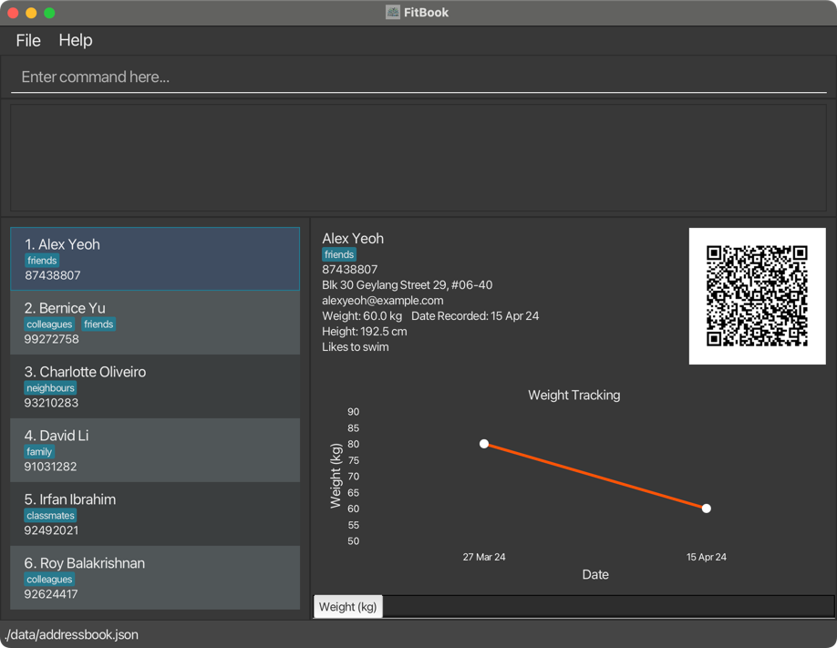

## About FitBook
FitBook is a **desktop app for managing your clients, optimized for use via a Command Line Interface** (CLI) while still having the benefits of a Graphical User Interface (GUI). If you are a personal trainer that prefers typing over mouse interactions, FitBook is the perfect application for you!

### Key features
{:.no_toc}

With FitBook, you can:

* **Seamlessly save clients as contacts on your phone using QR codes**
* **Store personalized notes for each client**
* **Keep track of your clients' weight**

_All in one app!_

For more details on what FitBook has to offer, check out the [Features](#features) section below!

## Using this guide
The purpose of this user guide is to **walk you through installing FitBook**, as well as be a **resource you can refer to** if you require any additional help. Think of it like an instruction manual that comes with a new gadget - You can refer to it if you get stuck, but otherwise, you're free to explore on your own!

You can use the [Table of contents](#table-of-contents) to navigate directly to what you're looking for.

:bulb: **Tips/Info**

Be on the lookout for boxes like these, they usually contain important information and helpful tips!

:warning: **Warning**

On the other hand, these boxes indicate when you should pay extra attention to avoid running into problems.

:rotating_light: **Caution**

Lastly, these boxes contain warnings about potential negative outcomes. 

(e.g. irreversible loss of data)

Can't wait to get started? [Click me](#setting-up-fitbook) to jump straight to the FitBook installation guide!

_Disclaimer: Certain portions of this guide assume you are familiar with the command line. If you aren't, check out this informative <a href="https://www.freecodecamp.org/news/command-line-for-beginners/" target="_blank">article from freeCodeCamp</a>._

## Table of contents

* Table of Contents
{:toc}

## Setting up FitBook

1. Ensure you have Java **11** or above installed.
    * [What version of Java do I have?](#what-version-of-java-do-i-have)
    * Need help installing Java? Check out the <a href="https://docs.oracle.com/en/java/javase/11/install/overview-jdk-installation.html" target="_blank">Java 11 installation guide</a>.

:question: **What is Java? Is it safe to install?**

Java is a versatile programming language used for developing various applications. FitBook requires it to be installed because it is written in Java and relies on the Java Virtual Machine (JVM) to run.

<a href="https://www.java.com/en/download/help/whatis_java.html" target="_blank">Learn more about Java</a>.

[//]: # (Continue numbering from 2, as the block above interrupts the list and resets the number)

{:start="2"}
1. Download the latest version of `FitBook.jar` from <a href="https://github.com/AY2324S2-CS2103T-T17-3/tp/releases" target="_blank">here</a>.

1. Copy the file to the folder you want to use as the **home folder** for FitBook.
   * FitBook will save all the data it needs in this folder.

1. Double-click the `FitBook.jar` file to launch it.
    * If that doesn't work, try the steps found [here](#why-doesnt-fitbook-start-when-i-double-click).

1. A GUI similar to the one depicted below should appear in a few seconds. The app contains some sample data for you to familiarize yourself with the UI. 

    

1. Read through `help`, type any command listed into the input box and press `enter`  
   These are some example commands you can try!
 
   * `add n/John p/98765432` Adds a client named
   `John Doe` with the number `98765432` to FitBook.

   * `clear` : Clears all clients from the list.

   * `delete 3` : Deletes the third client shown in the list.
   
   * `exit` : Exits the app.

   * `list` : Lists all clients.

1. Refer to the [Features](#features) below for details of each command.

--------------------------------------------------------------------------------------------------------------------

## Features

**:information_source: Notes about the command format:** 

* Words in `UPPER_CASE` are the parameters to be supplied by the user. 
  e.g. in `add n/NAME`, `NAME` is a parameter which can be used as `add n/John Doe`.

* Items in square brackets are optional. 
  e.g `n/NAME [t/TAG]` can be used as `n/John Doe t/friend` or as `n/John Doe`.

* Items with `…`​ after them can be used multiple times including zero times. 
  e.g. `[t/TAG]…​` can be used as ` ` (i.e. 0 times), `t/friend`, `t/friend t/family` etc.

* Parameters can be in any order. 
  e.g. if the command specifies `n/NAME p/PHONE_NUMBER`, `p/PHONE_NUMBER n/NAME` is also acceptable.

* Extraneous parameters for commands that do not take in parameters (such as `help`, `list`, `exit` and `clear`) will be ignored. 
  e.g. if the command specifies `help 123`, it will be interpreted as `help`.

* If you are using a PDF version of this document, be careful when copying and pasting commands that span multiple lines as space characters surrounding line-breaks may be omitted when copied over to the application.

### Viewing help : `help`

Launches the help menu depicted below.  
Clicking `Open User Guide` leads to the User Guide website.

Format: `help`

### Adding a client : `add`

Adds a client to the FitBook.

Format: `add n/NAME p/PHONE_NUMBER [e/EMAIL] [a/ADDRESS] [w/WEIGHT] [h/HEIGHT] [nt/NOTE] [t/TAG]…​`

:bulb: **Tip:**
A client can have 0 or more tags.

Examples:
* `add n/John Doe p/98765432 e/johnd@gmail.com a/John street, block 123, #01-01 nt/john from school`
* `add n/Betsy Crowe t/friend e/betsycrowe@hotmail.com a/Newgate Prison p/1234567 nt/likes donuts t/criminal`

### Listing all clients : `list`

Displays an indexed list of all clients in FitBook.

Format: `list`

### Editing a client : `edit`

Edits information tagged to an existing client.

Format: `edit INDEX [n/NAME] [p/PHONE] [e/EMAIL] [a/ADDRESS] [w/WEIGHT] [h/HEIGHT] [nt/NOTE] [t/TAG]…​`

* Edits the clients at the specified `INDEX`. The index refers to the index number shown in the displayed client list.
* The index **must be a positive integer** 1, 2, 3, …​
* At least one of the optional fields must be provided.
* Existing values will be updated to the input values.
* When no value is specified after a prefix, the value of that prefix will be removed from the client. (e.g. `edit 1 nt/` removes the note from the client at index 1).
    * Since WEIGHT can store multiple historical values, specifying an empty weight prefix removes the latest weight value from the client. Otherwise, the latest weight value will be replaced by the specified weight in this command.
* When editing tags, the existing tags of the client will be removed i.e adding of tags is not cumulative.
* You can remove all the client’s tags by typing `t/` without
    specifying any tags after it.

Examples:
*  `edit 1 p/91234567 e/johndoe@example.com` Edits the phone number and email address of the 1st client to be `91234567` and `johndoe@example.com` respectively.
*  `edit 2 n/Betsy Crower t/` Edits the name of the 2nd client to be `Betsy Crower` and clears all existing tags.

### Adding a note to a client : `note`

Format: `note INDEX [NOTE] `

* Edits the note of the client specified by `INDEX`. The index refers to the index number shown in the displayed client list. The index **must be a positive integer** 1, 2, 3, …​
* Existing note will be updated to the note specified.
* If no note is given, the note for the client at the specified index will be deleted.

> While this can also be done using the `edit` command, this `note` command serves as a faster way for users to directly modify a note.

Examples:

* `note 1 History of asthma` - Changes the note of the 1st client to `History of asthma`.
* `note 2 Previously sprained both ankles` - Changes the note of the 2nd client to `Previously sprained both ankles`.

If `/edit` is supplied instead of a note, (e.g. `note 1 /edit`), the contents of the command box will be replaced with a note command whose NOTE field is pre-loaded with the note of the client at the specified index.

> For example: Client at index 1 has the note "Wants to gain muscle".
>
> Executing the command `note 1 /edit` will replace the contents of the command box with `note 1 Wants to gain muscle`.

### Adding or overriding exercise(s) of clients : `fitadd`

Format: `fitadd INDEX n/EXERCISE_NAME [s/SETS] [r/REPS] [b/BREAK_BETWEEN_SETS_IN_SECONDS]`

* Adds the specified exercise(s) to the client specified by `INDEX`. The index refers to the index number shown in the displayed client list. The index **must be a positive integer** 1, 2, 3, …​
* If an exercise with same name already exists for the client, the old exercise will be overwritten with the newly supplied field values, or a default set of values (sets: 1, reps: 1, break: 0) if not supplied.

Alternatively, you can use any one of the supported prefixes to quickly add a predefined set of related exercises to the specified client.

Format: `fitadd INDEX [/arms] [/legs] [/chest] [/back] [/shoulders] [/abs] [/all]`

:warning: **Warning**

You must either specify a specific exercise name or use a number of default supported prefixes, but not both together.

Examples:

* `fitadd 1 n/burpees` - Adds or overwrites the `burpees` exercise of the 1st client with a default set of 1, repetition of 1 and 0 seconds break time between sets.
* `fitadd 1 n/burpees s/3 r/5 b/30` - Adds or overwrites the `burpees` exercise of the 1st client with sets of 3, repetitions of 5 and 30 seconds break time between sets.
* `fitadd 2 /arms` - Adds or overwrites a default set of exercises from the `arms` category to the 2nd client.
* `fitadd 2 /arms /legs` - Adds or overwrites a default set of exercises from the `arms` and `legs` category to the 2nd client.

### Deleting exercise(s) of clients : `fitdelete`

Format: `fitdelete INDEX n/EXERCISE_NAME [/all]`

* Deletes the specified exercises(s) from the client specified by `INDEX`. The index refers to the index number shown in the displayed client list. The index **must be a positive integer** 1, 2, 3, …​
* Supplying the `/all` prefix deletes all exercise(s) from the specified client.
 

:warning: **Warning**

You must either specify a specific exercise name or the `/all` prefix, but not both together.

Examples:

* `fitdelete 1 n/burpees` - Deletes the exercise with name `burpees` from the 1st client.
* `fitdelete 2 /all` - Deletes all exercise(s) from the 2nd client.

### Adding a weight value to a client : `weight`

Format: `weight INDEX [WEIGHT] `

* Adds a weight value to a client specified by `INDEX`. The index refers to the index number shown in the displayed client list. The index **must be a positive integer** 1, 2, 3, …​
* Weight values specified in this command will be added as a new weight value to the specified client. To edit the latest weight of the client, use the [`edit`](#editing-a-client--edit) command.
* If no weight value is given, the latest weight for the client at the specified index will be deleted.

> While the `edit` command allows one to **edit** a client's latest weight value, this `weight` command serves as a way for users to **add** a client's weight.

Examples:

* `weight 1 90` - Adds a new weight value of 90 to the client at index 1.
* `weight 2` - Deletes the latest weight value of the client at index 2.

### Searching clients : `find`

Finds all clients that match the specified attributes.

Format: `find [n/NAME] [p/PHONE] [e/EMAIL] [a/ADDRESS] [w/RANGE] [h/RANGE] [nt/NOTE] [t/TAG]…​`

* The search is case-insensitive for inputs that accept characters (i.e. `NAME, PHONE, EMAIL, ADDRESS, NOTE, TAG`). e.g `hans` will match `Hans`
* `RANGE` allows the user to search for a value that falls within the specified `RANGE`. The syntax is as follows:
    * `FROM, TO`. For example, to search for weights that fall between 70kg and 90kg, you can enter `w/70, 90`.
* Any fields specified in the format above can be searched.
* When an empty input is specified an optional field, only users that have value(s) available for that field will be showed. (e.g. `find w/` returns all clients that have at least one weight value associated to them).
* Multiple fields can be searched in one command.
    * All fields must match (e.g `find n/Wendy p/91234567` will match with a contact whose name **contains** `wendy` and phone number **contains** `91234567`)
* All fields except `TAG` will be matched based on substring (e.g `Wen` will match `Wendy`)

:warning: **Take note:**
* Unlike other fields, `TAG` must be an exact match (case-insensitive)
* E.g `find t/fri` will not match the tag `friend`
* But `find t/fRieNd` will match the tag `friend`

Examples:
* `find n/Wendy` returns `Wendy Son` and `Wendy Kim`
* `find n/Wendy t/Lover` returns `Wendy` (`Name` contains `Wendy` and is tagged with `Lover`)

### Deleting a client : `delete`

Deletes the specified client from FitBook.

Format: `delete INDEX`

* Deletes the client at the specified `INDEX`.
* The index refers to the index number shown in the displayed client list.
* The index **must be a positive integer** 1, 2, 3, …​

Examples:
* `list` followed by `delete 2` deletes the second client in the list.
* `find Betsy` followed by `delete 1` deletes the first client in the results of the `find` command.

### Clearing all entries : `clear`

Clears all client information from FitBook.

:rotating_light: **This command is irreversible. Use with caution.**

If you are sure of your decision to clear all client information, use the `/confirm` prefix with this command to execute it.

Format: `clear /confirm`

### Exiting the program : `exit`

Exits FitBook.

Format: `exit`

### Saving the data

FitBook data is saved to your hard disk automatically after any command that changes the data.
There is no need to save manually.

### Editing the data file

FitBook data is saved automatically as a JSON file `[JAR file location]/data/addressbook.json`.
Advanced users are welcome to update data directly by editing that data file.

:warning: **Warning:**
If your changes to the data file make its format invalid, FitBook will discard all data and start with an empty data file at the next run. Hence, it is recommended to make a backup of the file before editing it.

Furthermore, certain edits can cause FitBook to behave in unexpected ways (e.g., if a value entered is outside of the acceptable range, or an invalid field is specified). Therefore, edit the data file only if you are confident that you can update it correctly.

### Save contact to phone

To save a contact to your mobile phone from FitBook, simply scan the QR code next to the contact.

--------------------------------------------------------------------------------------------------------------------

## FAQ

###### How do I transfer my data to another Computer?

**A**: Install FitBook in the other computer and overwrite the empty data file it creates with the file that contains the data of your previous FitBook home folder.

###### What version of Java do I have?

**A**: Open a command prompt, and run the command `java --version`

###### Why doesn't FitBook start when I double-click?

**A**: If double-clicking to open FitBook doesn't work, try running it via the command line:

1. Open a command prompt (**cmd** for Windows, **Terminal** for Mac)

1. Use `cd` to navigate to the folder containing `FitBook.jar`
    * e.g. `cd ~/Downloads/FitBook/`

1. Run `java -jar FitBook.jar` to launch FitBook.

--------------------------------------------------------------------------------------------------------------------

## Known issues

1. **When using multiple screens**, if you move the application to a secondary screen, and later switch to using only the primary screen, the GUI will open off-screen. The remedy is to delete the `preferences.json` file created by the application before running the application again.

--------------------------------------------------------------------------------------------------------------------

## Command summary

| Action        | Format, Examples                                                                                                                                                                                    |
|---------------|-----------------------------------------------------------------------------------------------------------------------------------------------------------------------------------------------------|
| **Add**       | `add n/NAME p/PHONE_NUMBER [e/EMAIL] [a/ADDRESS] [nt/NOTE] [t/TAG]…​`   e.g., `add n/James Ho p/22224444 e/jamesho@example.com a/123, Clementi Rd, 1234665 nt/likes pizzas t/friend t/colleague` |
| **Clear**     | `clear`                                                                                                                                                                                             |
| **Delete**    | `delete INDEX`  e.g., `delete 3`                                                                                                                                                                 |
| **Edit**      | `edit INDEX [n/NAME] [p/PHONE_NUMBER] [e/EMAIL] [a/ADDRESS] [nt/NOTE] [t/TAG]…​`  e.g.,`edit 2 n/James Lee e/jameslee@example.com`                                                               |
| **Find**      | `find KEYWORD [MORE_KEYWORDS]`  e.g., `find James Jake`                                                                                                                                          |
| **FitAdd**    | `fitadd INDEX [n/EXERCISE_NAME] [s/SETS] [r/REPS] [b/BREAK_BETWEEN_SETS_IN_SECONDS] [/arms] [/legs] [/chest] [/back] [/shoulders] [/abs] [/all] `  e.g., `fitadd 1 n/burpees s/3 r/5 b/30`       |
| **FitDelete** | `fitdelete INDEX [n/EXERCISE_NAME] [/all]`  e.g., `fitdelete 1 n/burpees`                                                                                                                        |
| **List**      | `list`                                                                                                                                                                                              |
| **Help**      | `help`                                                                                                                                                                                              |
| **Note**      | `note INDEX [NOTE]`   e.g.   `note 2 Sprained right ankle in the past`                                                                                                                        |
| **Weight**    | `WEIGHT INDEX [WEIGHT]`   e.g.   `weight 3 70`                                                                                                                                                |

