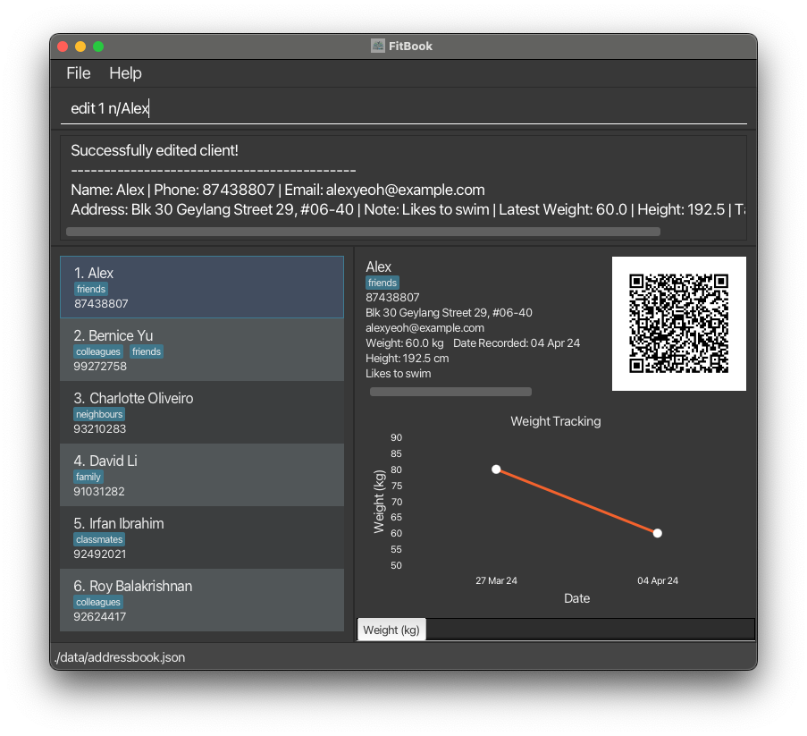

FitBook is a desktop application built for personal trainers to:

* **Manage clients' contact details.**
* **Monitor clients' progress.**
* **Curate personalised workout plans for each client.** 

While it has a Graphical User Interface (GUI), most user interactions happen through a Command Line Interface (CLI).

* If you are interested in _using_ FitBook, head over to the [**Quick Start**](UserGuide.html#quick-start) section of the [**User Guide**](UserGuide.html).
* If you are interested in _contributing_ to FitBook, the [**Developer Guide**](DeveloperGuide.html) is a good place to start.

**Acknowledgements**

* Libraries used: [JavaFX](https://openjfx.io/), [Jackson](https://github.com/FasterXML/jackson), [JUnit5](https://github.com/junit-team/junit5), [ZXing](https://github.com/zxing/zxing)
